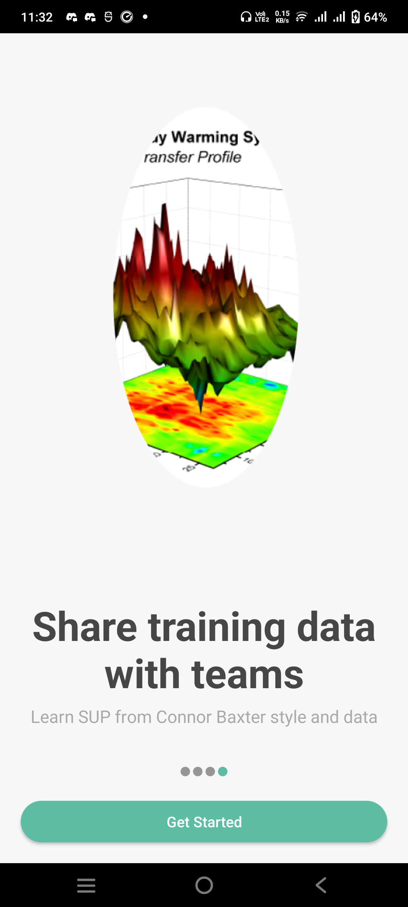
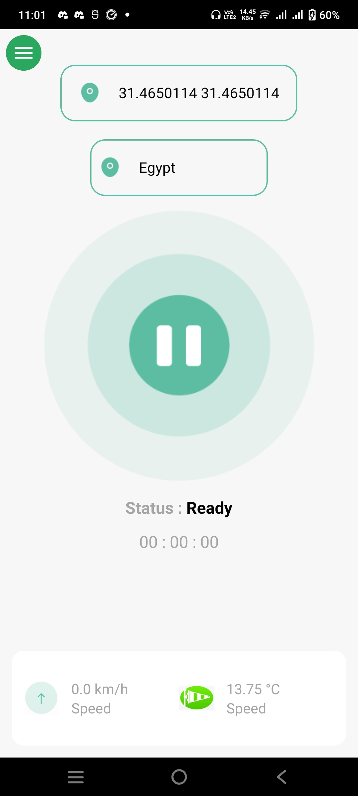

# FunPaddler - Boat Data Recording and Tracking App

**FunPaddler** is an Android application designed for boat enthusiasts to record, track, and analyze key boating data. The app provides real-time information about boat speed, wind speed, wind direction, and location. This data is stored for later use, allowing users to review their boating performance and use it for training purposes. 

With **FunPaddler**, you can log your activity, track your progress, and compare your performance over time. The app supports user authentication through **Phone Number**, **Google**, **Facebook**, or **Email and Password**.

## Screenshots

Here are some screenshots of the **FunPaddler** app:

|  |  |  |
| --- | --- | --- |
|  |  |  |

## Demo Video

You can also check out the demo video below for a quick overview of the app in action:

[

## Features

- **Real-time Tracking**: Records and displays boat speed, wind speed, and direction.
- **Location Tracking**: Uses GPS to record and display the boat's location.
- **Data Storage**: Records and stores boat data for future reference, including performance tracking and training purposes.
- **User Authentication**: Secure login and registration via **Phone Number**, **Google**, **Facebook**, or **Email and Password**.
- **Training Tool**: Data collected can be used later for training and performance improvement.

## Tech Stack

- **Android**: Native Android development platform.
- **Java**: Programming language used for app functionality.
- **Volley & Retrofit**: Used for network communication and data fetching.
- **Firebase**: For authentication and data storage.

## Installation

To run the app locally, follow these steps:

1. **Clone the repository**:
   ```bash
   git clone https://github.com/your-username/funpaddler.git
